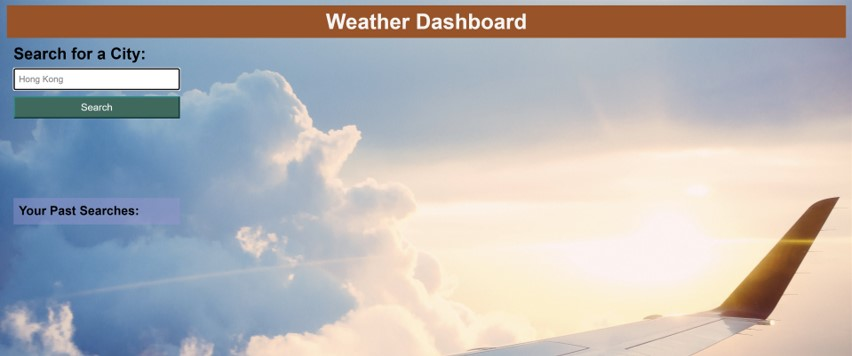

# Weather Dashboard

## Description

Having an app that shows current and future weather details makes planning a trip easier.

Weather Dashboard is one such application allows a user to search for a city's weather and get results for current conditions and view a a 5-day forecast.

The app runs in the browser and was built using HTML, CSS, JavaScript, and the OpenWeather API.

The deployed application can be viewed at: https://anitajose1.github.io/weather-dashboard/

